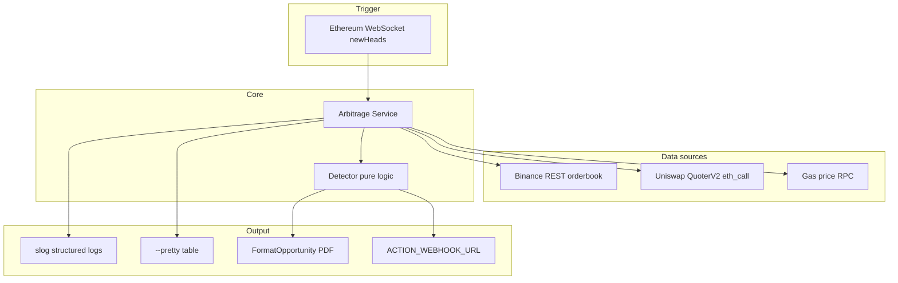

# CED-DEX Arbitrage Bot

Real-time **arbitrage detection** between Binance (CEX) and Uniswap V3 (DEX) for ETH-USDC.  
Triggered on each Ethereum block (~12 seconds). Detection only — no trade execution.

## Features

- Block-driven pipeline (WebSocket `newHeads`)
- Binance orderbook with effective price / slippage
- Uniswap V3 QuoterV2 quotes at block height
- Pure arbitrage detector (CEX→DEX and DEX→CEX)
- Gas-aware profit calculation
- Resilience: gas cache, rate limiting, RPC retry
- `--pretty` ASCII table per block
- `-simulate` offline demo (challenge PDF prices)
- Generic `ACTION_WEBHOOK_URL` for alerts (Slack, n8n, custom API)
- Docker + Makefile + CI

## Prerequisites

- Go 1.25+
- Docker (optional)
- `INFURA_API_KEY` (live mode)
- `ACTION_WEBHOOK_URL` (optional)

## Quick start

```bash
cp .env.example .env
# Edit .env

make test
make simulate          # offline demo — no API key needed
make pretty            # live mainnet, 3 blocks, table output
```

## Commands

| Command | Network | Description |
|---------|---------|-------------|
| `make test` | No | Unit tests |
| `make build` | No | Build `bin/bot` |
| `make simulate` | No | Offline demo + pretty table |
| `make simulate-notify` | Webhook | Demo + action webhook POST |
| `make run` | Mainnet | Live loop (Ctrl+C to stop) |
| `make pretty` | Mainnet | Live + table, 3 blocks |
| `make docker-simulate` | No | Simulate in Docker |
| `make docker-up` | Mainnet | Live in Docker |

### Flags

```bash
go run ./cmd/bot -simulate --pretty           # offline
go run ./cmd/bot --pretty -blocks 3           # live table
go run ./cmd/bot -notify                      # live + webhook on opportunity
go run ./cmd/bot -simulate --pretty -notify   # test webhook without mainnet
```

## Architecture



## Project structure

```
cmd/bot/              Entrypoint, flags, wiring
configs/config.yaml   Trade sizes, fees, resilience
internal/
  arbitrage/          Detector, service, pretty, simulate
  binance/            CEX client + slippage
  uniswap/            QuoterV2
  ethereum/           Block WebSocket subscriber
  cache/              Gas price TTL cache
  resilience/         Rate limit, retry
  notify/             Generic action webhook
  config/             YAML + .env loader
  common/             Constants, errors
```

## Configuration

**`configs/config.yaml`** — symbols, trade sizes, fees, resilience tuning.

**`.env`** — secrets:

```bash
INFURA_API_KEY=...           # live mode
ACTION_WEBHOOK_URL=...       # optional alerts
```

## Opportunity output (challenge format)

```
=== ARBITRAGE OPPORTUNITY DETECTED ===
Block Number: 18234567
...
Estimated Profit: $225.00 (before gas and fees)
Gas Cost: $9.00
Net Profit: $193.55 (after gas and fees)
Execution Steps:
...
```

Run `make simulate` to see a full example.

## Action webhook

POST JSON to `ACTION_WEBHOOK_URL`:

```json
{
  "event": "arbitrage.opportunity",
  "simulated": false,
  "text": "ARBITRAGE OPPORTUNITY DETECTED\n..."
}
```

Works with Slack incoming webhooks (`text` field), n8n, Zapier, or your own API.

## Docker

```bash
make docker-simulate
make docker-up
make docker-down
```

Image uses Go 1.25; rebuilds automatically via `--build` in Makefile targets.

## Graceful shutdown

`Ctrl+C` / `SIGTERM` cancels the context; WebSocket and service stop cleanly.

## Documentation

| File | Content |
|------|---------|
| [DECISIONS.md](DECISIONS.md) | Architecture choices and trade-offs |
| [TODO.md](TODO.md) | Future improvements |
| `context.md` | Full technical roadmap (Spanish) |
| `glossary.md` | DeFi concepts for beginners (Spanish) |

## Development

```bash
make test
make vet
go test ./internal/arbitrage/... -v   # detector + format tests
```

CI runs on push/PR to `main` (`.github/workflows/ci.yml`).

## License

Challenge / educational project.
